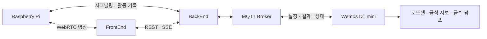

# ganadiCare · Sensor

**ganadiCare**의 카메라·센서·급식·급수 장치 코드입니다.
라즈베리파이는 반려동물 영상과 추적을, Wemos D1 mini는 사료·물 공급을 담당합니다.

[조직 소개](https://github.com/ganadiCare) · [BackEnd](https://github.com/ganadiCare/BackEnd) · [FrontEnd](https://github.com/ganadiCare/FrontEnd)

## 주요 기능

| 장치 | 역할 |
| --- | --- |
| Raspberry Pi 5 | 카메라 영상 수집, YOLO 객체 인식, 서보 추적, WebRTC 스트리밍 |
| 조도센서 | 주변 밝기에 따른 카메라 전환 판단 |
| 카메라 서보 | GPIO12/13 하드웨어 PWM으로 상하·좌우 제어 |
| Wemos D1 mini | MQTT 설정 수신, 예약 급식, 자동 급수, 결과·잔량 전송 |
| HX711 로드셀 2개 | 사료와 물의 무게 측정 |

## 통신 구조



## 디렉터리 안내

| 경로 | 설명 |
| --- | --- |
| `main.py` | 현재 라즈베리파이 통합 실행 코드 |
| `hardware_pwm.py` | Raspberry Pi 5 하드웨어 PWM 서보 제어 |
| `setup_hardware_pwm.sh` | PWM 활성화·export·권한 설정 |
| `install_hardware_pwm_service.sh` | 부팅 시 PWM 설정 서비스 설치 |
| `hardware-pwm-setup.service` | systemd 서비스 정의 |
| `camera.py`, `tracker.py`, `tracker_webrtc.py` | 개별 카메라·추적 구현 |
| `yolo11n.pt`, `yolov8n.pt` | 객체 인식 모델 |
| [wemos](wemos/README.md) | ESP8266 펌웨어·배선·MQTT·빌드 안내 |
| [tests/manual](tests/manual/README.md) | 수동 센서·카메라·서보 테스트 |

## 라즈베리파이 실행

### 1. 실행 환경

Raspberry Pi 5, 연결된 카메라와 서보, `rpicam-vid`, Python 3 환경이 필요합니다.
조도센서 사용 시 SPI를 활성화하고 배선을 확인합니다. 현재 코드는 SPI 버스 0, 장치 0을 사용합니다.

`main.py`가 사용하는 주요 Python 패키지는 다음과 같습니다.

```text
numpy · opencv-python · websockets · aiortc · av
ultralytics · python-dotenv · spidev
```

현재 의존성 버전을 고정한 파일은 없습니다. 라즈베리파이 OS·Python 버전에 맞춰 패키지와 필요한 시스템 라이브러리를 설치하세요.
통합 코드는 `yolo11n.pt`를 상대경로로 읽으므로 저장소 루트에서 실행합니다.

### 2. 접속 정보

저장소 루트에 `.env`를 만들고 실제 서버 정보를 입력합니다. `.env`는 Git 추적에서 제외됩니다.

```dotenv
SIGNAL_URL=ws://YOUR_BACKEND_HOST:8080/ws/signal
TURN_HOST=YOUR_TURN_HOST
TURN_USER=YOUR_TURN_USERNAME
TURN_PASS=YOUR_TURN_PASSWORD
```

공개 HTTPS 서비스에서는 배포 환경에 맞는 `wss://` 시그널링 주소를 사용하세요.
선택 설정은 `NIGHT_THRESHOLD`(기본 7), `DAY_THRESHOLD`(기본 4), `SERVO_HOLD_WHEN_IDLE`(기본 1)입니다.

### 3. 하드웨어 PWM 부팅 설정

GPIO12/13 서보 PWM의 export와 쓰기 권한은 재부팅하면 초기화됩니다.
아래 명령을 한 번 실행하면 systemd가 부팅할 때마다 자동으로 설정합니다.

```sh
sudo bash install_hardware_pwm_service.sh
```

스크립트가 재부팅 또는 재로그인을 안내하면 해당 작업을 진행하세요.
이 서비스는 PWM 준비를 담당하며 `main.py`를 자동 실행하지는 않습니다.

```sh
systemctl status hardware-pwm-setup.service
journalctl -u hardware-pwm-setup.service -b
```

### 4. 실행

```sh
python3 main.py
```

BackEnd의 `/ws/signal`에 Pi로 등록한 뒤 브라우저와 WebRTC 연결을 구성합니다.
하드웨어 테스트는 [수동 테스트 안내](tests/manual/README.md)를 참고하세요.

## Wemos 실행

1. `wemos/include/secrets.example.h`를 `secrets.h`로 복사합니다.
2. Wi-Fi, MQTT 계정 및 로드셀 교정값을 입력합니다.
3. PlatformIO에서 `d1_mini` 대상으로 빌드하고 업로드합니다.

```sh
cd wemos
pio run
pio run --target upload
pio device monitor
```

자세한 핀 배치와 시리얼 점검 명령은 [Wemos README](wemos/README.md)에 있습니다.
부팅 시 로드셀 영점을 잡으므로 내용물을 비운 그릇을 올려 초기 상태를 맞춥니다.

| MQTT 토픽 | 방향 | 용도 |
| --- | --- | --- |
| `homecam/config` | 서버 → Wemos | 급식 예약·급수 설정 |
| `homecam/events` | Wemos → 서버 | 공급 결과·시간별 잔량 |
| `homecam/status` | Wemos → 서버 | 연결 상태 |

현재 공통 토픽과 단일 Pi 세션을 사용하는 구성입니다. 여러 장치를 운영하려면 장치별 식별·라우팅 구분이 필요합니다.

## 저장소 관리

실제 비밀번호 파일, Python 캐시, PlatformIO 빌드 결과, 임시 테스트 영상과 백업은 Git에서 제외합니다.
펌웨어 빌드 성공과 실제 장치 동작 검증은 별개이며, 서보·펌프 테스트는 연결된 장치를 보면서 실행하세요.
